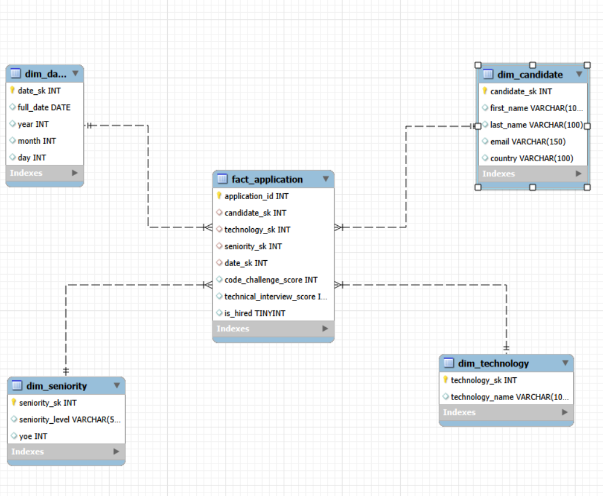

# Data Engineer Workshop 1: ETL Pipeline & Data Warehouse

## 1. Project Objective
This project simulates a real-world Data Engineering technical challenge. The goal is to design and implement an end-to-end ETL pipeline that extracts 50,000 rows of candidate application data from a CSV file, transforms it by applying specific business rules, and loads it into a PostgreSQL Data Warehouse utilizing a Dimensional Data Model (Star Schema). Finally, analytical KPIs are generated directly from the Data Warehouse to support business intelligence decisions.

## 2. Dimensional Data Model (Star Schema)

### Design Decisions
* **Grain Definition:** The grain of the Fact Table is defined strictly as **one row per candidate application**. This atomic level ensures maximum flexibility for future aggregations and prevents data loss.
* **Surrogate Keys:** Natural keys from the source data (such as emails) were intentionally avoided as Primary Keys in the Data Warehouse. Auto-incremental integer Surrogate Keys (SK) were generated for all dimension tables to isolate the DW from source system changes and optimize SQL JOIN performance in PostgreSQL.
* **Dimensions:** Contextual data was separated into `dim_candidate`, `dim_technology`, `dim_seniority`, and `dim_date` to support the required KPI filtering and dimensional slicing.

## 3. ETL Logic
* **Extract:** Raw data is ingested from a local CSV file using `pandas`, explicitly handling the `;` delimiter.
* **Transform:** Data types are validated and normalized. Surrogate keys are generated and mapped. The core business rule for the `is_hired` flag is applied at this stage: A candidate is marked as hired (1) only if `Code Challenge Score >= 7` AND `Technical Interview Score >= 7`.
* **Load:** The loading phase strictly enforces referential integrity. Dimension tables are inserted into PostgreSQL first, followed by the `fact_application` table, utilizing `SQLAlchemy`.

## 4. Data Quality Assumptions
Based on the Exploratory Data Analysis (EDA) performed on the raw dataset prior to the ETL process:
* **Completeness:** The dataset contains exactly 50,000 rows with no missing values (0 nulls across all columns). No imputation strategies were required.
* **Consistency:** The scoring columns (`Code Challenge Score` and `Technical Interview Score`) are strictly bounded between 0 and 10. Years of Experience (`YOE`) range logically from 0 to 30.
* **Uniqueness:** No exact duplicate rows were found. The combination of Candidate attributes alongside the application date ensures transaction uniqueness.

## 5. How to Run the Project
1. Clone the repository and navigate to the root directory.
2. Create a virtual environment and run `pip install -r requirements.txt`.
3. Set up a local PostgreSQL database named `etl_workshop`.
4. Execute the DDL script located in `sql/create_tables.sql` to generate the Star Schema and Foreign Keys.
5. Place the source file in `data/raw/candidates.csv`.
6. Update the `postgres_connection_string` in `src/main.py` with your local credentials.
7. Run the pipeline: `python src/main.py`.

## 6. Example Outputs & KPIs
All reports and KPIs were generated by connecting Power BI directly to the PostgreSQL Data Warehouse, completely bypassing the raw CSV file.

The dashboard includes the following analytical metrics:
1. **Hires by Technology:** Horizontal bar chart displaying successful hires per tech stack.
2. **Hires by Year:** Line chart tracking recruitment trends over time.
3. **Hires by Seniority:** Column chart breaking down hires by experience level.
4. **Hires by Country over Years:** Line chart strictly filtered to focus on the USA, Brazil, Colombia, and Ecuador.
5. **Hire Rate (%):** A custom DAX measure showing the overall process efficiency.
6. **Average Scores:** Comparative metrics isolating the performance of hired vs. non-hired candidates.

*Note: The raw SQL queries used to validate these KPIs are available in `sql/kpi_queries.sql`.*